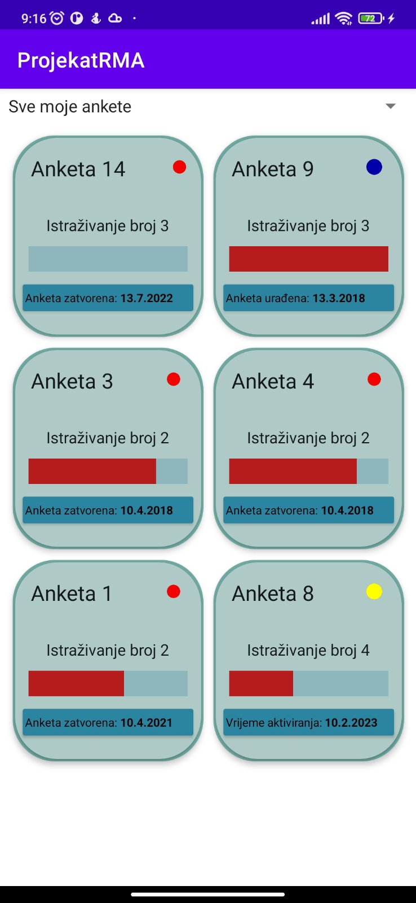
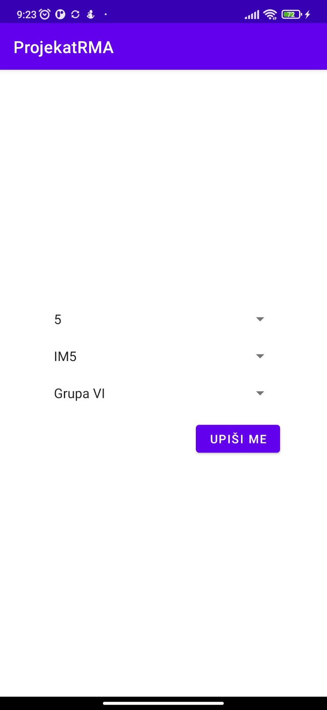
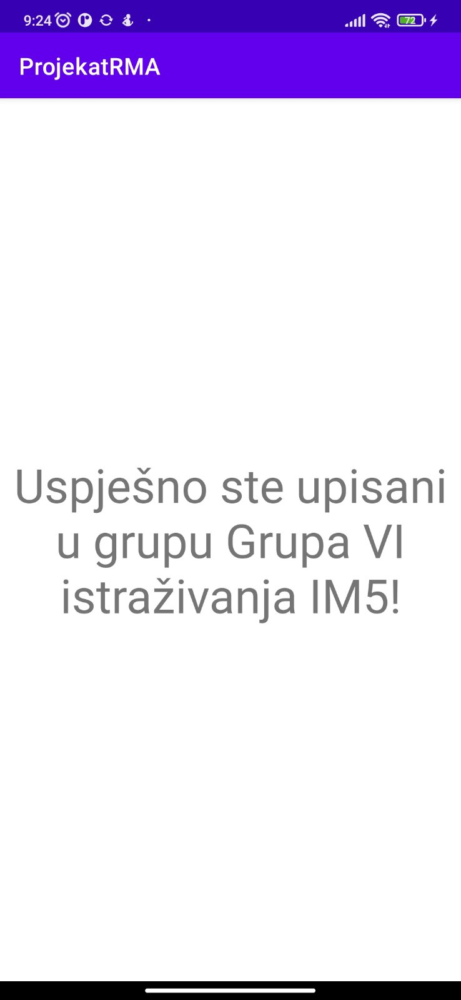
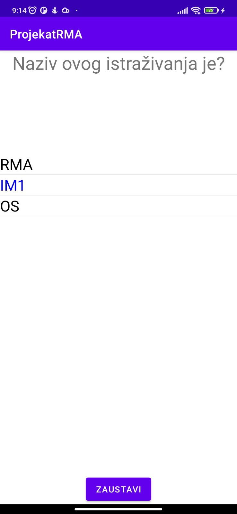

# Survey-App-RMA

Project for the course "Development of Mobile Applications".

Functionalities

<ul>
<li>Overview of all available surveys</li>
<li>Register to a survey group</li>
<li>Filter surveys</li>
<li>Fill out surveys</li>
<li>View survey progress</li>
</ul>

<table>
  <tr>
    <td><h3>1.) Overview of all available surveys</h3>
    <td><h3>2.) Register to a survey group</h3>
    <td><h3>3.) Successful registration</h3>
  </tr>
  <tr>
    <td></td>
    <td></td>
    <td></td>
  </tr>
 </table>
 
<table>
  <tr>
<td><h3>4.) Fill out surveys</h3></td>
 </tr>
 <tr>
<td></td>
</tr>

